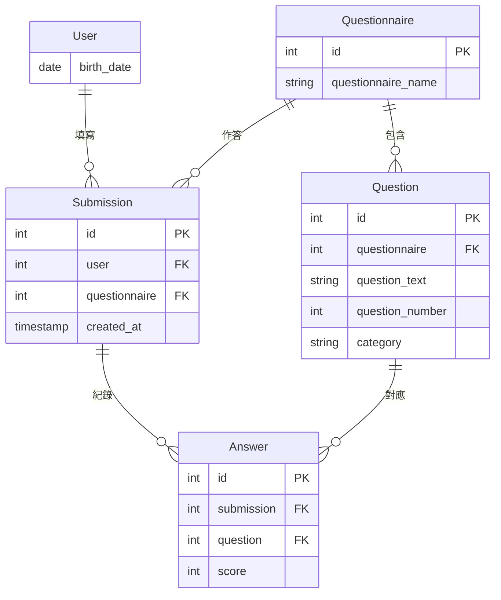

# HearWell

面向患者的聽力健康自我照護工具。

台灣約有三成 65 歲以上長者有聽力損失，但從察覺症狀到實際就醫，平均延遲長達 7 到 10 年。這段延遲的代價不只是聽不清楚——研究顯示未經處理的聽力損失與社交孤立、認知退化有顯著關聯。

HearWell 的設計目標是縮短這段延遲：讓使用者能在家中完成標準化的聽力障礙自評、記錄日常聆聽困難的具體情境、以白話理解自己的聽力檢查結果，並在需要時被引導至專業協助。

本專案由執業聽力師開發，篩檢工具採用經驗證的 HHIE-S 量表。

**線上展示：** [連結](https://hearwell.onrender.com/)
**技術棧：** Django · PostgreSQL · Bootstrap(Bootswatch) · Docker · 部署在Render

## 功能

- 註冊、登入
- 選擇問卷並作答（HHIE-S）
- 自動計分，顯示分級結果與行動建議
- 查看歷次篩檢紀錄

## 資料模型

(User繼承自Django AbstractUser)


## 本機開發

### 需要先安裝

- Python 3.13
- Docker Desktop（用來執行本機的 PostgreSQL）

### 第一次設定

1. 取得程式碼並建立虛擬環境

   ```bash
   git clone <https://github.com/minuet878-prog/HearWell.git>
   cd HearWell
   python3.13 -m venv .venv
   source .venv/bin/activate
   pip install -r requirements.txt
   ```

2. 啟動 PostgreSQL 容器（版本與正式環境一致，為 18）

   ```bash
   docker run -d --name hearwell-db \
     -e POSTGRES_USER=hearwell \
     -e POSTGRES_PASSWORD=password \
     -e POSTGRES_DB=hearwell_dev \
     -p 127.0.0.1:5432:5432 \
     -v hearwell-pgdata:/var/lib/postgresql \
     postgres:18
   ```

   - 連接埠只綁定 `127.0.0.1`，區域網路上的其他裝置連不到資料庫
   - 資料存在 `hearwell-pgdata` volume，容器停止或重建都不會遺失
   - PostgreSQL 18 起，volume 要掛在 `/var/lib/postgresql`，不是舊版的 `/var/lib/postgresql/data`

3. 設定環境變數

   ```bash
   cp .env.example .env
   ```


4. 建立資料表、載入題目、建立管理員

   ```bash
   python manage.py migrate
   python manage.py loaddata questions_fixture.json
   python manage.py createsuperuser
   ```

5. 啟動開發伺服器

   ```bash
   python manage.py runserver
   ```

### 日常使用

電腦重開機後容器會停止，先打開 Docker Desktop，再執行：

```bash
docker start hearwell-db
```

直接進資料庫下 SQL：

```bash
docker exec -it hearwell-db psql -U hearwell -d hearwell_dev
```

### 環境變數

| 變數 | 必填 | 說明 |
|---|---|---|
| `DATABASE_URL` | 是 | 格式 `postgres://使用者:密碼@主機:埠/資料庫`，缺少時啟動即報錯 |
| `DEBUG` | 否 | 本機開發設為 `True`；正式環境不設定或設為 `False` |
| `SECRET_KEY` | 正式環境必填 | `DEBUG=False` 時缺少會報錯 |
| `ALLOWED_HOSTS` | 否 | 以逗號分隔，預設 `127.0.0.1,localhost` |

## 常用指令

```bash
python manage.py test                      # 跑測試
ruff check .                               # lint
ruff format .                              # 格式化
python manage.py check --deploy            # 部署前安全檢查（DEBUG=False 下執行）
python manage.py makemigrations --check --dry-run  # 確認沒有漏掉的 migration
```

## 部署

部署於 Render，`main` 有新 commit 時自動部署。`build.sh` 依序執行 `pip install`、`collectstatic`、`migrate`。

## 文件

- `docs/decisions.md`：設計決策、理由與踩過的坑