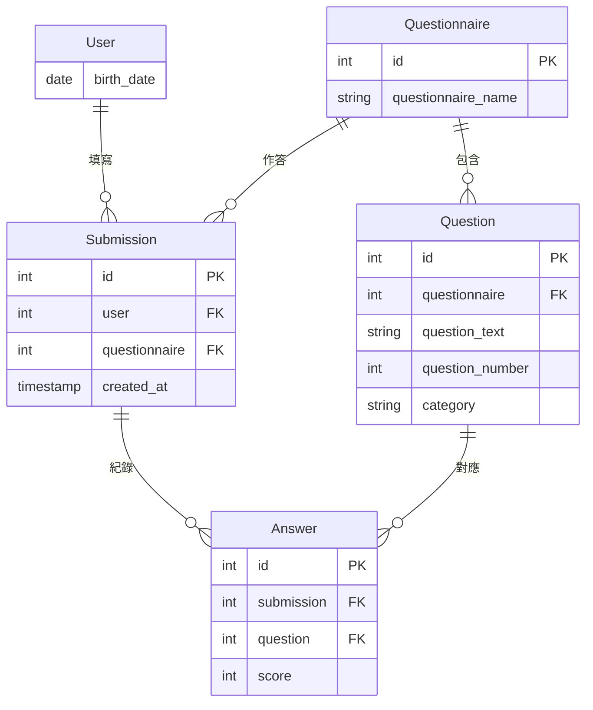

# HearWell

面向患者的聽力健康自我照護工具。

台灣約有三成 65 歲以上長者有聽力損失，但從察覺症狀到實際就醫，平均延遲長達 7 到 10 年。這段延遲的代價不只是聽不清楚——研究顯示未經處理的聽力損失與社交孤立、認知退化有顯著關聯。

HearWell 的設計目標是縮短這段延遲：讓使用者能在家中完成標準化的聽力障礙自評、記錄日常聆聽困難的具體情境、以白話理解自己的聽力檢查結果，並在需要時被引導至專業協助。

本專案由執業聽力師開發，篩檢工具採用經驗證的 HHIE-S 量表。

**線上展示：** [連結]
**技術棧：** Django · PostgreSQL · JavaScript · Chart.js

資料模型
(User繼承自Django AbstractUser)
